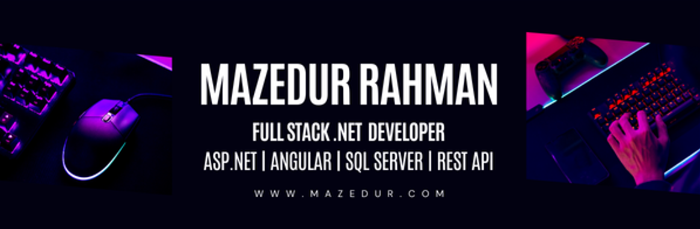

## Hi 👋, This is Mazed  

<!--
**isrt09/isrt09** is a ✨ _special_ ✨ repository because its `README.md` (this file) appears on your GitHub profile.

Here are some ideas to get you started:
- 👯 I’m looking to collaborate on 
- 💬 Ask me about ...
- 😄 Pronouns: ...
- ⚡ Fun fact: ...
-->
- 🔭 I’m currently working on Enveto 
- 🌱 I’m currently learning ** Microservice, Angular, React **
- 🤔 I’m looking for help with Microsoft .NET Technologies
- :mailbox: How to reach me :  **mazedur@gmail.com**
- :computer: Connect with me on&nbsp; [ LinkedIn](https://www.linkedin.com/in/mazedur/)
>

  
  &nbsp; &nbsp; &nbsp;
    

<h2 align="left" id="macropower-tech">Languages and Tools</h2>

> Tools, languages, and other things that I like to work with.

<table>  
  <tr>
    <td align="center" width="96">
            
       
    </td>      
    <td align="center" width="96">
            
       
    </td>
    <td align="center" width="96">
            
       
    </td>
    <td align="center" width="96">
            
       
    </td>
    <td align="center" width="96">
            
       
    </td>    
    <td align="center" width="96">
            
       
    </td>        
    <td align="center" width="96">
            
       
    </td>
    <td align="center" width="96">
            
       
    </td>
    <td align="center" width="96">
            
       
    </td>
    <td align="center" width="96">
            
       
    </td>    
    <td align="center" width="96">
            
       
    </td>
    <td align="center" width="96">
            
       
    </td>
    <td align="center" width="96">
            
       
    </td>    
    <td align="center" width="96">
            
       
    </td>    
  </tr>
  <tr>
    <td align="center" width="96">
            
       
    </td>
    <td align="center" width="96">
            
       
    </td>
    <td align="center" width="96">
            
       
    </td>    
    <td align="center" width="96">
            
       
    </td>
    <td align="center" width="96">
            
       
    </td>
    <td align="center" width="96">
            
       
    </td>
     <td align="center" width="96">
            
       
    </td>
     <td align="center" width="96">
            
       
    </td>
    <td align="center" width="96">
            
       
    </td>
    <td align="center" width="96">
            
       
    </td>
    <td align="center" width="96">
            
       
    </td>
    <td align="center" width="96">
            
       
    </td>
    <td align="center" width="96">
            
       
    </td>
    <td align="center" width="96">
            
       
    </td>
  </tr>
</table>
